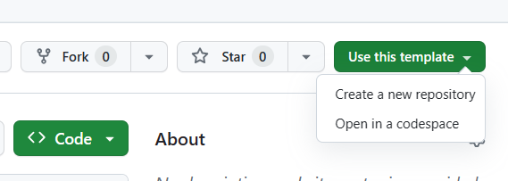
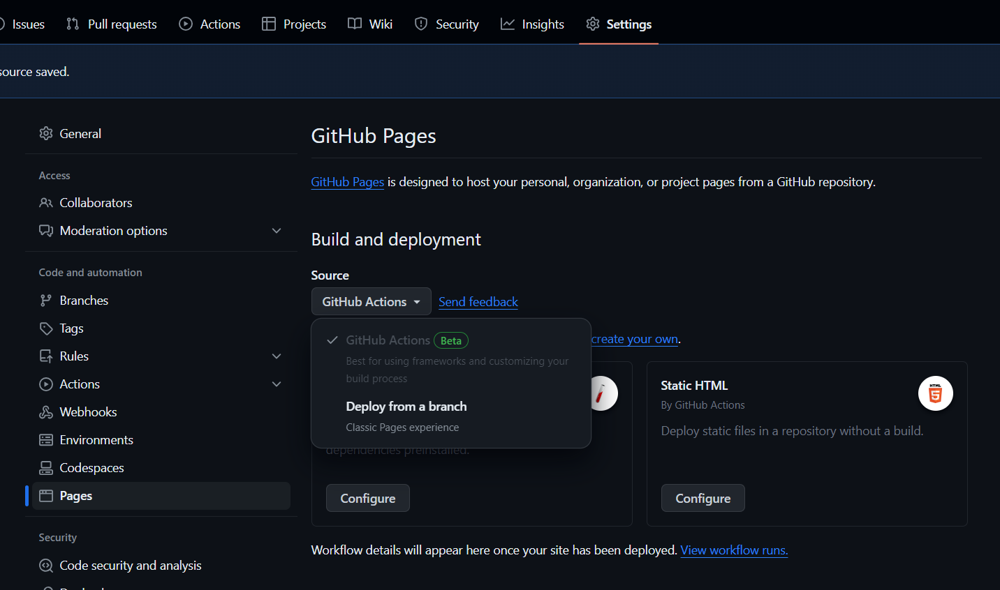

# create-svelte

## Generate static site using svelte SSG

To assist you in creating a static webpage for GitHub Pages using Svelte, we have developed a template for you: [ShaokangJiang/svelte-template (github.com)](https://github.com/ShaokangJiang/svelte-template).

Please follow the link provided, and initiate the creation of a new repository.



After GitHub completes the cloning process, navigate to the settings page. On the left panel, under the "Pages" tab, locate the "Source" section and select "GitHub Actions" as the source. 

Clone this repository and proceed with your work. Upon completion, commit and push your changes. The corresponding GitHub Actions will then execute, building a static website hosted at `https://your-username.github.io/your-repo-name` for you.



### Migrate from your project

If you have started on the project and want to switch to using this template, you can copy your `src` folder, go to the local clone of your version of this template, then paste it. When it says the file exists, simply click replace, and you can continue working on your version of this template.

## Setup

Once you've created a project and installed dependencies with `npm install` (or `pnpm install` or `yarn`), start a development server:

```bash
npm run dev

# or start the server and open the app in a new browser tab
npm run dev -- --open
```

## Building static site

Just push to github. 
